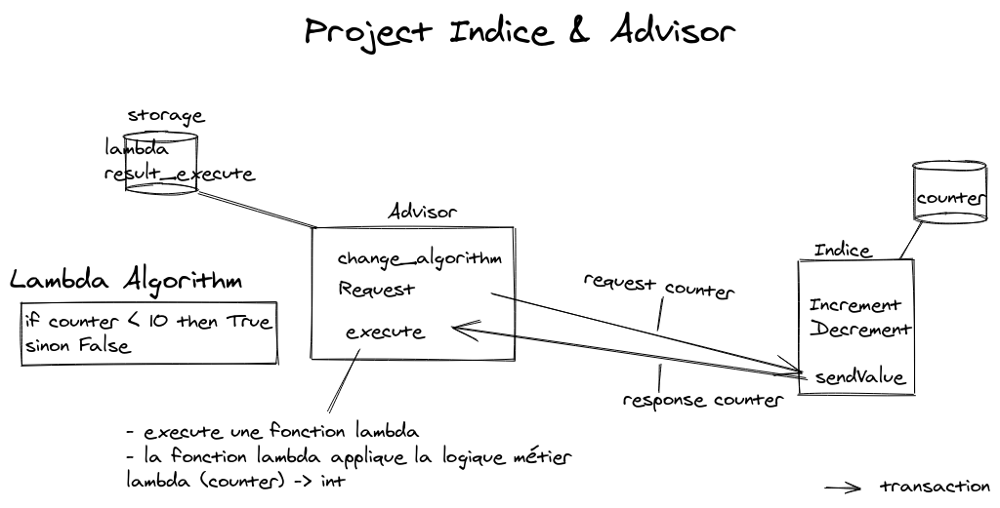

# ligo_tutorial_fundadvisor

This tutorial deals with implementing, deploying and interacting with Tezos smart contracts. This tutorial is meant to illustrate the communication between contracts (with `get_entrypoint_opt` LIGO function) and lambda pattern which allows to modify a contract already deployed.

## The Fund and its advisor (i.e. "L'indice et le conseiller")

The `indice` contract represents a fund value and the `advisor` contract give an advice on investment on this fund. 

### Transaction workflow

When invoked, the `advisor` contract will request to the `indice` contract the fund value (via a transaction) and when the `indice` contract sends back the requested value it will applying it marvelous algorithm to advice on 'yes' or 'no' it is worth investing !

The resulting advice is stored in the storage (in `result` field).

### Lambda pattern

The real business logic of the `advisor` smart contract lies in the lambda function which is defined in the storage. The storage is vowed to be modified and it is the same for the lambda.

So an entrypoint `ChangeAlgorithm` is provided to modify the algorithm that computes the worth of investment. 

## Content

The `src` directory contains pascal-ligo smart contracts implementation and related Michelson code. 

The `videos` directory contains live-programming stream of implementing and testing smart contracts (with `ligo` and `tezos-client` in a sandbox).